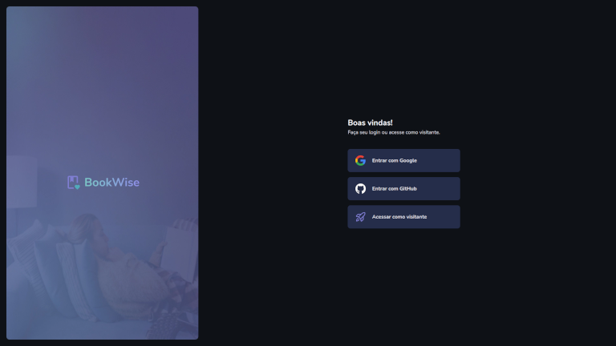

<h1 align="center"> BookWise  </h1>

	The BookWise project is a BFF(❤️) application and the final project of the Ignite React Course, where I'm using NextJS, ReactJs, NextAuth, Prisma, and MySQL. Alongside the course requirements, I'm doing an extra credit here, using Next 13 with the /app folder structure featuring server components, so lots of fun...
  

  

 

  <h3 align='center'>Web</h3>
  

## ✅ Status

- Under Development 🚧

## 👨🏼‍💻 Functions

- OAuth2 with NextAuth
- Server Components
- Styling with TailwindCSS

## 🚀 Technologies

This project is using the following technologies:

- NextJS
- Typescript
- TailwindCSS 
- Lucide Icons
- Git e Github
- Prisma
- NextAuth

## 💻 Project

This project is being developed to solve the final challenge of Ignite's React track

- [Access the project under development, online](https://bookwise-eta-hazel.vercel.app/login)

## 🔖 Layout

- Access the project layout through [this link](https://www.figma.com/file/MCcU1p4cINFoGHSTUQ0Ebs/BookWise--%E2%80%A2-Desafio-React-(Copy)?type=design&mode=design&t=fZmAFp81zCuDPnla-0). A [Figma](https://figma.com) account is required.

## :memo: License

- Excluding the layout, this project is under the license GPL-3
